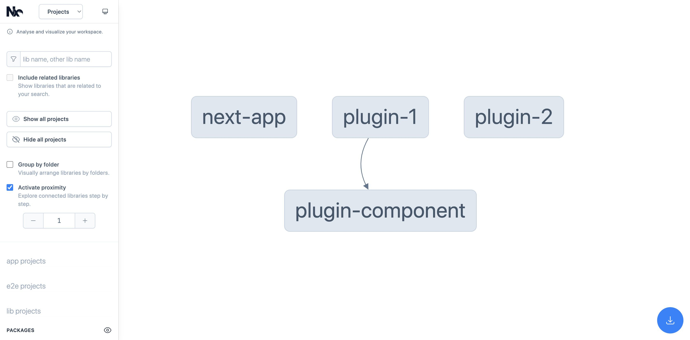

# Monorepo React Template

基于 Lerna 的单一存储库示例，它创建了一个用于管理和发布多个包的现代构建系统。

---

- [English](README.md)
- [中文](README_CN.md)

---


.


## 目录结构


```sh
monorepo-react-template/
├── README.md
├── README_CN.md
├── LICENSE
├── lerna.json  
├── nx.json
├── custom.webpack.config.js    ---------------- (设置 `react-scripts` 命令的 webpack 配置)
├── package.json
├── package-lock.json
├── packages/ 
│   ├── front-end/     ------------------------- (基于nextjs, 应该进入此目录单独编译它)
│   ├── plugin-component/  --------------------- (使用 TypeScript 编译)
│   ├── plugin-1/   ---------------------------- (依赖于 `plugin-component`)
│   ├── plugin-2/   ---------------------------- (使用 create-react-app 5+ 的 `react-scripts` 命令)
│   └── .../
└──
```


## 入门

确保您的计算机上是否安装了 Node 14+.

### 第1步：通过运行以下命令创建一个新的 Lerna 工作空间：

```sh
$ cd /{your_directory}/monorepo-react-template
$ npx lerna init
```


### 第2步：安装依赖（必须）

它会将 `packages/` 目录里的所有资源的依赖都自动安装，并且不会重复。

```sh
$ npm install
```
 

### 第3步：要打开可视化效果，请运行：

```sh
$ npx nx graph
```
 
### 第4步：要构建所有项目，请运行

```sh
$ npm run cra:init
$ npx lerna run build
```

或者构建你想要的包（推荐使用此命令）：

```sh
$ npm run cra:init
$ npx lerna run build --scope=plugin-1 --scope=plugin-2 --scope=plugin-component
```

请不要全局安装 **learn** 来使用 `lerna run build ` 命令


### 第5步：(可选) 使用自定义的脚本，如：

```sh
$ npx lerna exec npm run export --scope=plugin-2
```
  


<blockquote>
<h3>⚠️ 提示1</h3>

确保 `packages/plugin-component` 已经被复制到 `node_modules` 目录中, 因为 `packages/plugin-1` 依赖于 `packages/plugin-component`.


<h3>⚠️ 提示2</h3>

`packages/` 目录中的项目不应该包含 `node_modules/` 文件夹。

packages中项目的 scripts 配置需要支持全局的，比如不存在 `react-scripts` 命令。 您需要先全局安装它。 其他命令也是如此。


```sh
$ sudo npm install --g react-scripts
```

同理:

```sh
$ sudo npm install --g webpack webpack-cli
```

<h3>⚠️ 提示3</h3>

除 `packages/front-end` 外的其它 packages 内的项目依赖项应该在根目录的 package.json 文件中配置。


<h3>⚠️ 提示4</h3>

如果npm包安装失败，请先执行以下命令

```sh
$ sudo npm cache clean --force
```
或者

```sh
$ sudo chown -R 501:20 "/Users/<YOUR_USER_NAME>/.npm"
```

<h3>⚠️ 提示5</h3>

Failure Logs:

>  NX   dlopen(/<package_name>/node_modules/@nrwl/nx-darwin-x64/nx.darwin-x64.node, 1): no suitable image found.  Did find:

   	/<package_name>/node_modules/@nrwl/nx-darwin-x64/nx.darwin-x64.node: cannot load 'nx.darwin-x64.node' (load command 0x80000034 is unknown)
   	/<package_name>/node_modules/@nrwl/nx-darwin-x64/nx.darwin-x64.node: cannot load 'nx.darwin-x64.node' (load command 0x80000034 is unknown)


如果出现以上错误，请确保 `nx` 包，即 `node_modules/@nrwl` 的版本是 **15.7.2**，**15.8.x** 以上的版本无法正确运行 lerna 和 nx 命令。


</blockquote>

 
 ---

更多的命令请参考 [Here](https://lerna.js.org/docs/getting-started).


## ⚙️ 自定义构建功能配置


从输出包中排除依赖项，您可以更改 `package.json` 文件：

`buildConfig` 属性将链接到 Webpack 配置。

```json
{
    ...
    "buildConfig": {
        "externals": {
            "react": "React",
            "react-dom": "ReactDOM"
        }
    },
    ...
}
```

如果要取消外部文件设置，请修改为:

```json
{
    ...
    "buildConfig": {
        "externals": ""
    },
    ...
}
```


## 感谢

- [Lerna](https://github.com/lerna/lerna)


## 许可证

Licensed under the [MIT](https://opensource.org/licenses/MIT).

